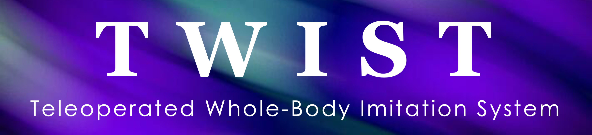

# TWIST
[CoRL 2025] | [[Website]](https://humanoid-teleop.github.io/)
[[Arxiv]](https://arxiv.org/abs/2505.02833)
[[Video]](https://www.youtube.com/watch?v=QgA7jNoiIZo)





```bibtex
@article{ze2025twist,
title={TWIST: Teleoperated Whole-Body Imitation System},
author= {Yanjie Ze and Zixuan Chen and João Pedro Araújo and Zi-ang Cao and Xue Bin Peng and Jiajun Wu and C. Karen Liu},
year= {2025},
journal= {arXiv preprint arXiv:2505.02833}
}
```

Demo 1: diverse loco-manipulation skills by TWIST.

https://github.com/user-attachments/assets/7c2b874e-e713-47e1-8e84-0efb93c419b5


Demo 2: a video recording showing the low-level controller and high-level motion sender in TWIST (fully reproduced in this repo)

https://github.com/user-attachments/assets/4953b6de-5c84-4a4b-9391-75818903a654


# News
- [2025.09.29] TWIST is fully open-sourced, including 1) training motion datasets, 2) training code for both teacher & student policy, 3) sim2sim & sim2real scripts, 4) model checkpoint [here](assets/twist_general_motion_tracker.pt), i.e., a general motion tracker.
- [2025.08.04] Real-time retargeting is released. See [GMR](https://github.com/YanjieZe/GMR).
- [2025.08.01] TWIST is accpeted by CoRL 2025.


# Installation
The training can be run on a single Nvidia RTX 4090 with 24G memory in 1~2 days.

**1**. Create conda environment:
```bash
conda env remove -n twist
conda create -n twist python=3.8
conda activate twist
```

**2**. Install isaacgym. Download from [official link](https://developer.nvidia.com/isaac-gym) and then install it:
```bash
cd isaacgym/python && pip install -e .
```

**3**. Install packages:
```bash
cd rsl_rl && pip install -e . && cd ..
cd legged_gym && pip install -e . && cd ..
pip install "numpy==1.23.0" pydelatin wandb tqdm opencv-python ipdb pyfqmr flask dill gdown hydra-core imageio[ffmpeg] mujoco mujoco-python-viewer isaacgym-stubs pytorch-kinematics rich termcolor 
pip install redis[hiredis]
pip install pyttsx3 # for voice control
cd pose && pip install -e . && cd ..
```

if you wanna do sim2real, you also need to install [unitree_sdk2py](https://github.com/unitreerobotics/unitree_sdk2_python).
```bash
git clone https://github.com/unitreerobotics/unitree_sdk2_python.git
cd unitree_sdk2_python
pip3 install -e .
```


**4**. Download TWIST dataset from [my google drive](https://drive.google.com/file/d/1bRAGwRAJ3qZV94IBIyuu4cySqZM95XBi/view?usp=sharing) [Small note: if you use this dataset in your project, please also add proper citation to this work]. Unzip it to anywhere you like, and specify the `root_path` in `legged_gym/motion_data_configs/twist_dataset.yaml` to the unzipped folder.

**5**. Ready for training & deployment!

# Usage
We have provided the trained student ckpt in `assets/twist_general_motion_tracker.pt`. You can directly use it for deployment. 

And we have also provided full motion datasets to ensure you can successfully train our teacher & student policy.


**1**. Training teacher policy via RL:
```bash
bash train_teacher.sh 0927_twist_teacher cuda:0
```
- arg 1: teacher policy expid
- arg 2: cuda device id


**2**. Training student policy via RL+BC (make sure  the teacher policy expid is the same above)
```bash
bash train_student.sh 0927_twist_rlbcstu 0927_twist_teacher cuda:0
```
- arg 1: student policy expid
- arg 2: teacher policy expid
- arg 3: cuda device id

**3**. Export student policy to jit model:
```bash
bash to_jit.sh 0927_twist_rlbcstu
```
- arg 1: student policy expid

You should see something like this:
```bash
Saved traced_actor at /home/yanjieze/projects/g1_wbc/TWIST-clean/legged_gym/logs/g1_stu_rl/0927_twist_rlbcstu/traced/0927_twist_rlbcstu-47500-jit.pt
Robot: g1
```

**4**. Sim2sim verification:

[If this is your first time to run this script] you need to warm up the redis server by running the high-level motion server.
```bash
cd deploy_real
python server_high_level_motion_lib.py --motion_file PATH/TO/YOUR/MOTION/FILE
```
You can just select one motion file from our motion dataset.

Then, you can run the low-level simulation server.
```bash
python server_low_level_g1_sim.py --policy_path PATH/TO/YOUR/JIT/MODEL
```
- This will start a simulation that runs the low-level controller only.
- This is because we separate the high-level control (i.e., teleop) from the low-level control (i.e., RL policy).
- You should now be able to see the robot stand still.

And now you can control the robot via high-level motion server.
```bash
python server_high_level_motion_lib.py --motion_file PATH/TO/YOUR/MOTION/FILE --vis
```


 

**5**. Sim2real verification. If you are not familiar with the deployment on physical robot, you can refer to [unitree_g1.md](./unitree_g1.md) or [unitree_g1.zh.md](./unitree_g1.zh.md) for more details.

More specifically, the pipeline for sim2real deploy is:
1. start the robot and connect the robot and your laptop via an Ethernet cable.
2. config the corresponding net interface on your laptop, by setting the IP address as `192.168.123.222` and the netmask as `255.255.255.0`.
3. now you should be able to ping the robot via `ping 192.168.123.164`.
4. then use Unitree G1's remote control to enter dev mode, i.e., press the `L2+R2` key combination.
5. now you should be able to see the robot joints in the damping state.
6. then you can run the low-level controller by:
```bash
cd deploy_real
python server_low_level_g1_real.py --policy_path PATH/TO/YOUR/JIT/MODEL --net YOUR_NET_INTERFACE_TO_UNITREE_ROBOT
```


Similarly, you run the low-level controller first and then control the robot via high-level motion server.
```bash
python server_high_level_motion_lib.py --motion_file PATH/TO/YOUR/MOTION/FILE --vis
```

**6**. Real-time teleop. We provide a legacy version we use in May 2025 here: `deploy_real/server_motion_optitrack_v2 (legacy).py`. 
- As later we have upgraded to use [GMR](https://github.com/YanjieZe/GMR) for real-time teleop, you can first check [GMR](https://github.com/YanjieZe/GMR) for real-time motion retargeting. After you can successfully run GMR with your MoCap, it would be very easy to modify our provided script to your setting.
- The teleop script could be further improved. We are preparing to release the new version soon, and this old teleop script will be only used for your reference.

# Contact
If you have any questions, please contact me at `yanjieze@stanford.edu`.

